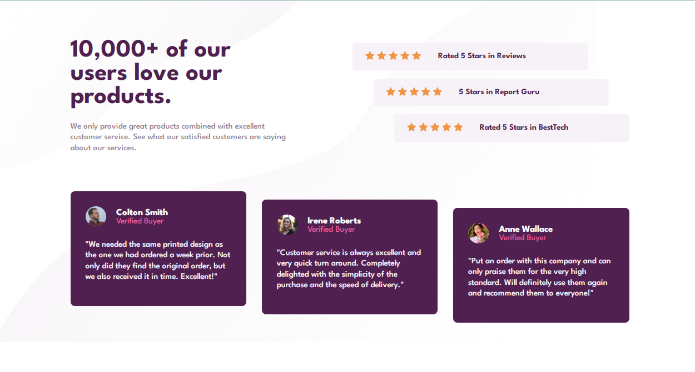
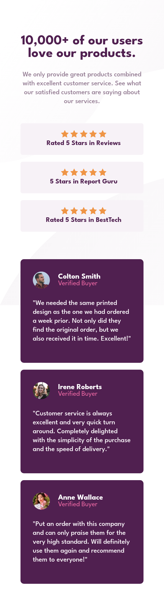
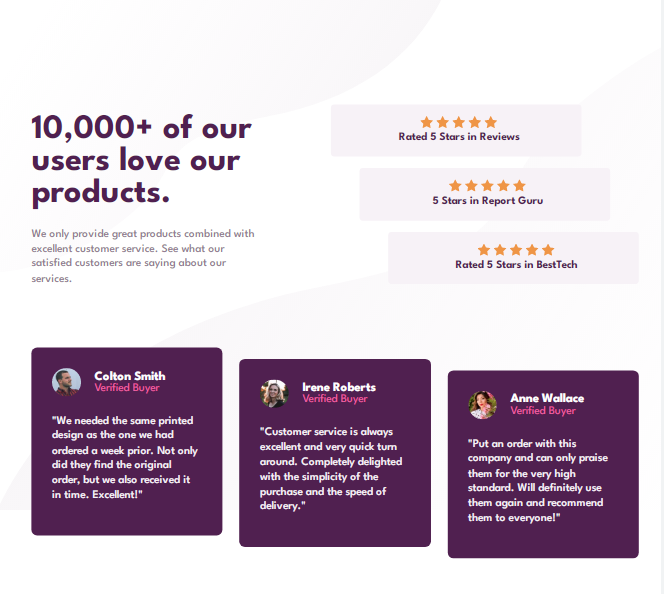

# Frontend Mentor - Social proof section solution

This is a solution to the [Social proof section challenge on Frontend Mentor](https://www.frontendmentor.io/challenges/social-proof-section-6e0qTv_bA). Frontend Mentor challenges help you improve your coding skills by building realistic projects. 

## Table of contents

- [Overview](#overview)
  - [The challenge](#the-challenge)
  - [Screenshot](#screenshot)
  - [Links](#links)
- [My process](#my-process)
  - [Built with](#built-with)
  - [What I learned](#what-i-learned)
- [Author](#author)
- [Acknowledgments](#acknowledgments)


## Overview

### The challenge

Users should be able to:

- View the optimal layout for the section depending on their device's screen size

### Screenshot

### Desktop Design Screenshot
 

 ### Mobile Design Screenshot


### Desktop Design @885px Screenshot


### Links

- Solution URL: [solution URL](https://www.frontendmentor.io/solutions/social-proof-section-using-flexbox-nsmmIg8FsZ)
- Live Site URL: [ live site URL](https://finney06.github.io/social-proof-section/)

## My process

### Built with

- Semantic HTML5 markup
- CSS custom properties
- Flexbox
### What I learned
  I learnt how to use the  ``` transform: translateX ``` and ```transform: translateY``` properties to move the rating and the customer review section to it's desired position.


```css
.rate:nth-of-type(1) {
    transform: translateX(-5rem);
}

.rate:nth-of-type(2) {
    transform: translateX(-2.5rem);
}
```
```css
.each-buyer:nth-of-type(2) {
    transform: translateY(1rem);
}

.each-buyer:nth-of-type(3) {
    transform: translateY(2rem);
}

```


## Author
- Frontend Mentor - [@Finney06](https://www.frontendmentor.io/profile/Finney06)
- Twitter - [@Osa_finney](https://www.twitter.com/@Osa_finney)
- Github - [@finney06](https://github.com/Finney06)


## Acknowledgments
All Glory to GOD.